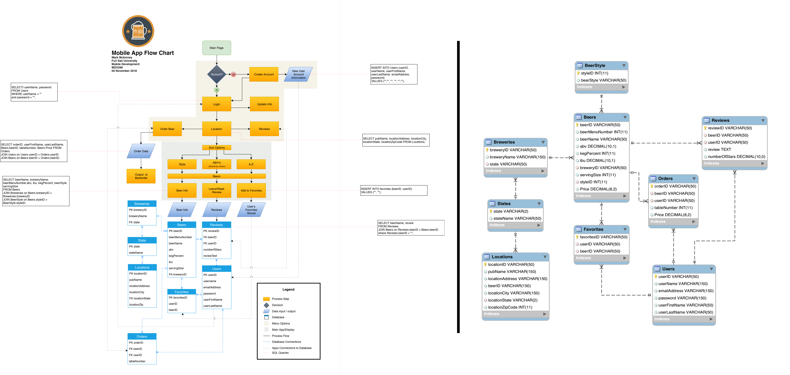

  
This repository is a collection of my work from Project and Portfolio II
 
 

 
> ### My Beer Application
> This application is a beer menu for local breweries and restaurants. It requires a user to login or create an account. Once logged in they must select a location with each location having their own list of beers. The user can select to view the menu sorting the list by beer name, ABV, or by beer style. Inside the application a user can also order a beer which the data is printed in the form of a receipt to the establistments kitchen or staff as well as stored inside a database. In addition the user can add and/or remove their favorite beers from the entire list of beer (2000+) under their favorites tab. lastly user's can write reviews about each beer also giving it a rating 1-5.
   

>  
 

 
> ### Time Tracker Application
> Time Tracker is an application that adds and manages life events for display. It also runs calulations showing the user how much, percentage, etc that spend on a certain activity every day, week, and month. The information is stored in a database 

 

  
> ### Code Exercise 01 - Coffee List
>This program gives the user options to order a list of coffee companies A-Z, Z-A, randomly as well as randomly narrows down a coffee of the day.

> ### Code Exercise 02 - Guess What
> The computer gives the user a question in attempts to answer correctly. After so many failed attempted the computer gives the user clues related to the question.
>
> ### Code Exercise 03 - Calculating Grades
> This application manages grades for students. It allows the user to change students grades for individual courses as well as provides total grades and GPA’s for student and courses.
> 
> ### Code Exercise 04 - Color Dictionary
> This application has a list of colors the user can choose from stored in a dictionary (Red, Orange, Yellow, Green, Blue, Indigo, Violet). The user selects a color and 3 seperate facts are displayed to the console.

> ### Code Exercise 05 - Rock, Paper, Scissors
> The user plays Rock, Paper, Scissors, Lizard, Spock. The Big Bang Theory version!! The user plays the computer in a series of 10 games which is then totaled at the end to determine who wins. 
  Incase you are unaware:
  (Scissors cuts paper, paper covers rock, rock crushes lizard, lizard poisons Spock, Spock smashes scissors, scissors decapitates lizard, lizard eats paper, paper disproves Spock, Spock vaporizes rock, and as it always has, rock crushes scissors.)

> ### Code Exercise 05 - Rock, Paper, Scissors
> The user inputs four players names. The computer then deals each play all the cards in a deck 2-A. The players’ cards are revealed and totaled up to determine who has the highest total. The players and their totaled are listed in 1st, 2nd, 3rd, 4th place order.
2-10 = Card value,
J,Q,K = 12,
A = 15
